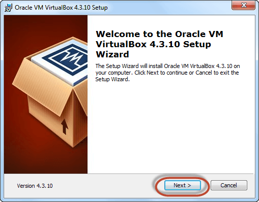
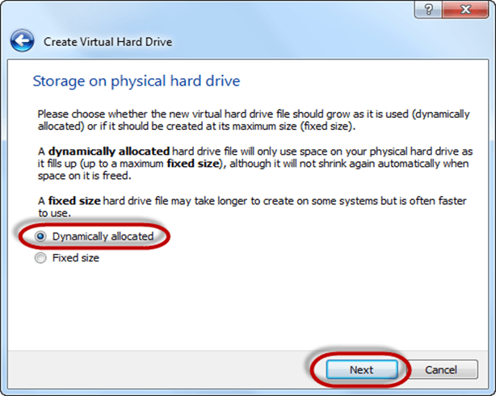
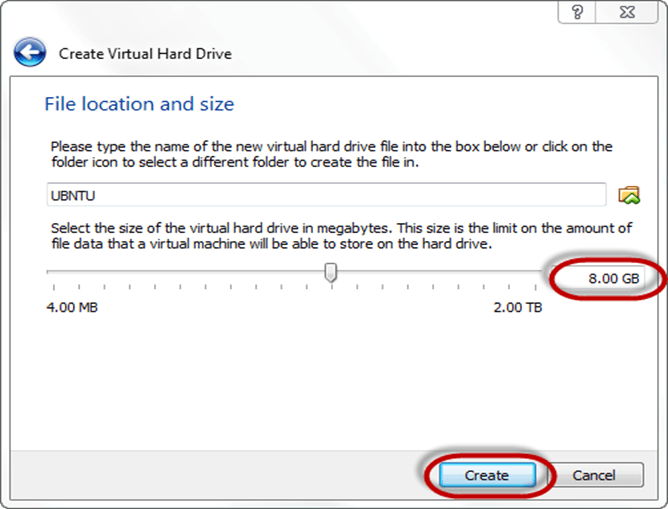
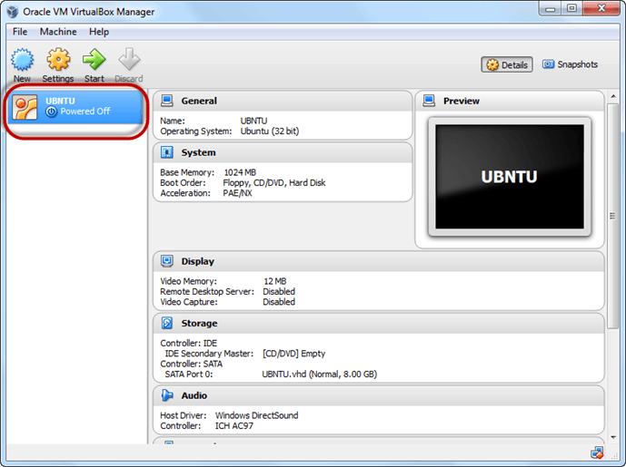

## Linux Tutorial
This tutorial is about Linux knowledge. It is intended for personal use only.

## Introduction to Linux Operating System
Linux is a community of open-source Unix like operating systems that are based on the Linux Kernel. It initially released by Linus Torvalds on September 17, 1991. It is a free and open-source operating system and the source code can be modified and distributed to anyone commercially or non commercially under the GNU General Public License.
Initially, Linux is created for personal computers gradually it is used in other machines like servers, mainframe computers, supercomputers, etc. Nowadays, Linux is also used in embedded systems like routers, automation controls, televisions, digital video recorders, video game consoles, smartwatches, etc. The biggest success of Linux is Android(operating system) it is based on the Linux kernel that is running on smartphones and tablets. Due to android Linux has the largest installed base of all general-purpose operating systems. Linux is generally packaged in a Linux distribution.

## What is Linux?
LINUX is an operating system or a kernel distributed under an open-source license. Its functionality list is quite like UNIX. The kernel is a program at the heart of the Linux operating system that takes care of fundamental stuff, like letting hardware communicate with software.

##  Why do you need an OS?
Every time you switch on your computer, you see a screen where you can perform different activities like write, browse the internet or watch a video. What is it that makes the computer hardware work like that? How does the processor on your computer know that you are asking it to run a mp3 file?

Well, it is the operating system or the kernel which does this work. So, to work on your computer, you need an Operating System(OS). In fact, you are using one as you read this on your computer. Now, you may have used popular OS's like Windows, Apple OS X, but here we will learn what Linux is and what benefits it offers over other OS choices.

 ## Who created Linux?

 

Linux is an operating system or a kernel which germinated as an idea in the mind of young and bright Linus Torvalds when he was a computer science student. He used to work on the UNIX OS (proprietary software) and thought that it needed improvements.

However, when his suggestions were rejected by the designers of UNIX, he thought of launching an OS which will be receptive to changes, modifications suggested by its users.

##  The benefits of using Linux
Linux now enjoys popularity at its prime, and it's famous among programmers as well as regular computer users around the world. Its main benefits are -

It offers a free operating system. You do not have to shell hundreds of dollars to get the OS like Windows!
 

## Linux Distribution
Linux distribution is an operating system that is made up of a collection of software based on Linux kernel or you can say distribution contains the Linux kernel and supporting libraries and software. And you can get Linux based operating system by downloading one of the Linux distributions and these distributions are available for different types of devices like embedded devices, personal computers, etc. Around 600 + Linux Distributions are available and some of the popular Linux distributions are:

MX Linux
Manjaro
Linux Mint
elementary
Ubuntu
Debian
Solus
Fedora
openSUSE
Deepin
Architecture of Linux
Linux architecture has the following components:
.
## How many distributions are out there?

There are hundreds of Linux operating systems or Distributions available these days. Many of them are designed with a specific purpose in mind. For example, to run a web server or to run on network switches like routers, modems, etc.

The latest example of one of the most popular smartphone-based Linux Distribution is Android!

Many of these Distributions are built to offer excellent personal computing.

## Installing Linux
Let's look the various methods we can use to install Ubuntu.

## Installing Linux using USB stick
This is one of the easiest methods of installing Ubuntu or any distribution on your computer. Follow the steps.
  

## Step 1) Download the .iso or the OS files on your computer from this link.

 
## Step 2) Download free software like 'Universal USB installer to make a bootable USB stick.
  
  

## Step 3) Select an Ubuntu Distribution form the dropdown to put on your USB

Select your Ubuntu iso file download in step 1.

Select the drive letter of USB to install Ubuntu and Press create button.

## Step 4) Click YES to Install Ubuntu in USB.

## Step 5) After everything has been installed and configured, a small window will appear Congratulations! You now have Ubuntu on a USB stick, bootable and ready to go.

## Installing Linux using Virtual Machine
This is a popular method to install a Linux operating system. The virtual installation offers you the freedom of running Linux on an existing OS already installed on your computer. This means if you have Windows running, then you can just run Linux with a click of a button.

Virtual machine software like Oracle VM can install Ubuntu in easy steps. Let us look at them.

Here the brief steps

## PART A) Download and Install Virtual Box

Download Virtual box using this link

Depending on your processor and OS, select the appropriate package. In our case, we have selected Windows with AMD

Once the download is complete, Open setup file and follow the steps below:

Step-1) Click On next

Step-2) Select you're the directory to install VirtualBox and click on next.

Step-3) Select Desktop icon and click on next, now click on yes

Step-4) Click On install.

Step-5) Now installation of the virtual box will start. Once complete, click on Finish Button to start Virtual Box

The virtual box dashboard looks like this-

PART B) Download Ubuntu

Visit this link to download Ubuntu.

You can select 32/64-bit versions as per your choice.

PART C) Create a Machine in Virtual Box

Step-1) Open Virtual box and click on new button

Step-2) In next window, give the name of your OS which you are installing in virtual box. And select OS like Linux and version as Ubuntu 32 bit. And click on next

Step-3) Now Allocate Ram Size To your Virtual OS. I recommended keeping 1024mb (1 GB) ram to run Ubuntu better. And click on next.

Step-4) Now To run OS in virtual box we have to create virtual hard disk, click on create a virtual hard drive now and click on create button.

The virtual hard disk is where the OS installation files and data/applications you create/install in this Ubuntu machine will reside

Step-5) select VHD (virtual hard disk) option and click on next.

Step-6) Click on dynamic allocated and click on next. This means that the size of the disk will increase dynamically as per requirement.

Step-7) Allocate memory to your virtual hard drive .8GB recommended. Click on create button.

Step-8) Now you can see the machine name in left panel

So a Machine (PC) with 8GB Hardisk, 1GB RAM is ready.

PART D) Install Ubuntu on the Machine

Step 1) Select the Machine and Click on Start

Step 2) Select the Folder Option

Step 3) Select the Ubuntu iso file

Step 4) Click Start

Step-5) You have an option to Run Ubuntu WITHOUT installing. In this tutorial will install Ubuntu

Step-6) Click continue.

Step-7) Select option to erase the disk and install Ubuntu and click on install now. This option installs Ubuntu into our virtual hard drive which is we made earlier. It will not harm your PC or Windows installation

Step-8) Select your location for setting up time zone, and click on continue

Step-9) Select your keyboard layout, by default English (US) is selected but if you want to change then, you can select in the list. And click on continue

Step-10) Select your username and password for your Ubuntu admin account. This information has been needed for installing any software package into Ubuntu and also for login to your OS. Fill up your details and tick on login automatically to ignore login attempt and click on continue

Step-11) Installation process starts. May take up to 30 minutes. Please wait until installation process completes.

Step-12) After finishing the installation, you will see Ubuntu Desktop.

Summary

An operating system based on the Linux kernel is called a Distribution or Distro
There are hundreds of Distributions available, some of which are designed to accomplish a sole purpose like running servers, act as network switches, etc.
Naming the best Linux Distribution is difficult as they are made for different.
Linux can be installed on your system via the below-mentioned methods:
USB stick
Live CD
Virtual Installation

 ## Components of Linux System
 
 Linux Operating System has primarily three components

## Kernel
     − Kernel is the core part of Linux. It is responsible for all major activities of this operating system. It consists of various modules and it interacts directly with the underlying hardware. Kernel provides the required abstraction to hide low level hardware details to system or application programs.

## System Library 
    − System libraries are special functions or programs using which application programs or system utilities accesses Kernel's features. These libraries implement most of the functionalities of the operating system and do not requires kernel module's code access rights.

## System Utility 
    − System Utility programs are responsible to do specialized, individual level tasks.
linux_os
  

## Kernel Mode vs User Mode
Kernel component code executes in a special privileged mode called kernel mode with full access to all resources of the computer. This code represents a single process, executes in single address space and do not require any context switch and hence is very efficient and fast. Kernel runs each processes and provides system services to processes, provides protected access to hardware to processes.

Support code which is not required to run in kernel mode is in System Library. User programs and other system programs works in User Mode which has no access to system hardware and kernel code. User programs/ utilities use System libraries to access Kernel functions to get system's low level tasks.

## Basic Features
    Following are some of the important features of Linux Operating System.

    Portable − Portability means software can works on different types of hardware in same way. Linux kernel and application programs supports their installation on any kind of hardware platform.

    Open Source − Linux source code is freely available and it is community based development project. Multiple teams work in collaboration to enhance the capability of Linux operating system and it is continuously evolving.

    Multi-User − Linux is a multiuser system means multiple users can access system resources like memory/ ram/ application programs at same time.

    Multiprogramming − Linux is a multiprogramming system means multiple applications can run at same time.

    Hierarchical File System − Linux provides a standard file structure in which system files/ user files are arranged.

    Shell − Linux provides a special interpreter program which can be used to execute commands of the operating system. It can be used to do various types of operations, call application programs. etc.

    Security − Linux provides user security using authentication features like password protection/ controlled access to specific files/ encryption of data.

## Linux-Architecture

Kernel: Kernel is the core of the Linux based operating system. 

The architecture of a Linux System consists of the following layers −

Hardware layer − Hardware consists of all peripheral devices (RAM/ HDD/ CPU etc).

Kernel − It is the core component of Operating System, interacts directly with hardware, provides low level services to upper layer components.

Shell − An interface to kernel, hiding complexity of kernel's functions from users. The shell takes commands from the user and executes kernel's functions.

Utilities − Utility programs that provide the user most of the functionalities of an operating systems.

## Advantages of Linux
The main advantage of Linux, is it is an open-source operating system, means the source code is easily available for everyone and you are allowed to contribute, modify and distribute the code to anyone without any permissions.
In terms of security, Linux is more secure than any other operating system. It does not mean that Linux is 100 percent secure it has some malware for it but is less vulnerable than any other operating system. So, it does not require any anti-virus software.
The software updates in Linux are easy and frequent.
Various Linux distributions are available so that you can use them according to your requirements or according to your taste.
Linux is freely available to use on the internet.
It has large community support.
It provides high stability. It rarely slows down or freezes and there is no need to reboot it after a short time.
It maintain the privacy of the user.
The performance of the Linux system is much higher than other operating systems. It allows a large number of people to work at the same time and it handles them efficiently.
It is network friendly.
The flexibility of Linux is high. There is no need to install a complete Linux suit you are allowed to install only required components.
Linux is compatible with a large number of file formats.
It is fast and easy to install from the web. It can also install in any hardware even in your old computer system.
It performs all tasks properly even if it has limited space on the hard disk.
Disadvantages of Linux
It is not much user-friendly. So, it may be confusing for beginners.
It has small peripheral hardware drivers as compared to windows.
Is There Any Difference between Linux and Ubuntu?

The answer is YES. The main difference between Linux and Ubuntu is Linux is the family of open-source operating systems which is based on Linux kernel, whereas Ubuntu is a free open-source operating system and the Linux distribution which is based on Debian. Or in other words, Linux is the core system and Ubuntu is the distribution of Linux. Linux is developed by Linus Torvalds and released in 1991 and Ubuntu is developed by Canonical Ltd. and released in 2004
   
## Operating System - Overview
   An Operating System (OS) is an interface between a computer user and computer hardware. An operating system is a software which performs all the basic tasks like file management, memory management, process management, handling input and output, and controlling peripheral devices such as disk drives and printers.

Some popular Operating Systems include Linux Operating System, Windows Operating System, VMS, OS/400, AIX, z/OS, etc.

Definition
An operating system is a program that acts as an interface between the user and the computer hardware and controls the execution of all kinds of programs. 
  

Following are some of important functions of an operating System.

            Memory Management
            Processor Management
            Device Management
            File Management
            Security
            Control over system performance
            Job accounting
            Error detecting aids
            Coordination between other software and users
Memory Management

            Memory management refers to management of Primary Memory or Main Memory. Main memory is a large array of words or bytes where each word or byte has its own address.

            Main memory provides a fast storage that can be accessed directly by the CPU. For a program to be executed, it must in the main memory. An Operating System does the following activities for memory management −

            Keeps tracks of primary memory, i.e., what part of it are in use by whom, what part are not in use.

            In multiprogramming, the OS decides which process will get memory when and how much.

            Allocates the memory when a process requests it to do so.

            De-allocates the memory when a process no longer needs it or has been terminated.

Processor Management

            In multiprogramming environment, the OS decides which process gets the processor when and for how much time. This function is called process scheduling. An Operating System does the following activities for processor management −

            Keeps tracks of processor and status of process. The program responsible for this task is known as traffic controller.

            Allocates the processor (CPU) to a process.

            De-allocates processor when a process is no longer required.

Device Management

            An Operating System manages device communication via their respective drivers. It does the following activities for device management −

            Keeps tracks of all devices. Program responsible for this task is known as the I/O controller.

            Decides which process gets the device when and for how much time.

            Allocates the device in the efficient way.

            De-allocates devices.

File Management

            A file system is normally organized into directories for easy navigation and usage. These directories may contain files and other directions.

            An Operating System does the following activities for file management −

            Keeps track of information, location, uses, status etc. The collective facilities are often known as file system.

            Decides who gets the resources.

            Allocates the resources.

            De-allocates the resources.

Other Important Activities
Following are some of the important activities that an Operating System performs −

Security 
    − By means of password and similar other techniques, it prevents unauthorized access to programs and data.

Control over system performance 
    − Recording delays between request for a service and response from the system.

Job accounting 
    − Keeping track of time and resources used by various jobs and users.

Error detecting aids 
    − Production of dumps, traces, error messages, and other debugging and error detecting aids.

Coordination between other softwares and users 
    − Coordination and assignment of compilers, interpreters, assemblers and other software to the various users of the computer systems.

## Types of Operating System
    Operating systems are there from the very first computer generation and they keep evolving with time. In this chapter, we will discuss some of the important types of operating systems which are most commonly used.

## Batch operating system
The users of a batch operating system do not interact with the computer directly. Each user prepares his job on an off-line device like punch cards and submits it to the computer operator. To speed up processing, jobs with similar needs are batched together and run as a group. The programmers leave their programs with the operator and the operator then sorts the programs with similar requirements into batches.

## The problems with Batch Systems are as follows −

Lack of interaction between the user and the job.
CPU is often idle, because the speed of the mechanical I/O devices is slower than the CPU.
Difficult to provide the desired priority.
Time-sharing operating systems
Time-sharing is a technique which enables many people, located at various terminals, to use a particular computer system at the same time. Time-sharing or multitasking is a logical extension of multiprogramming. Processor's time which is shared among multiple users simultaneously is termed as time-sharing.

The main difference between Multiprogrammed Batch Systems and Time-Sharing Systems is that in case of Multiprogrammed batch systems, the objective is to maximize processor use, whereas in Time-Sharing Systems, the objective is to minimize response time.

Multiple jobs are executed by the CPU by switching between them, but the switches occur so frequently. Thus, the user can receive an immediate response. For example, in a transaction processing, the processor executes each user program in a short burst or quantum of computation. That is, if n users are present, then each user can get a time quantum. When the user submits the command, the response time is in few seconds at most.

The operating system uses CPU scheduling and multiprogramming to provide each user with a small portion of a time. Computer systems that were designed primarily as batch systems have been modified to time-sharing systems.

## Advantages of Timesharing operating systems are as follows −

Provides the advantage of quick response.
Avoids duplication of software.
Reduces CPU idle time.
Disadvantages of Time-sharing operating systems are as follows −

Problem of reliability.
Question of security and integrity of user programs and data.
Problem of data communication.
Distributed operating System
Distributed systems use multiple central processors to serve multiple real-time applications and multiple users. Data processing jobs are distributed among the processors accordingly.

The processors communicate with one another through various communication lines (such as high-speed buses or telephone lines). These are referred as loosely coupled systems or distributed systems. Processors in a distributed system may vary in size and function. These processors are referred as sites, nodes, computers, and so on.

## The advantages of distributed systems are as follows −

With resource sharing facility, a user at one site may be able to use the resources available at another.
Speedup the exchange of data with one another via electronic mail.
If one site fails in a distributed system, the remaining sites can potentially continue operating.
Better service to the customers.
Reduction of the load on the host computer.
Reduction of delays in data processing.
Network operating System
A Network Operating System runs on a server and provides the server the capability to manage data, users, groups, security, applications, and other networking functions. The primary purpose of the network operating system is to allow shared file and printer access among multiple computers in a network, typically a local area network (LAN), a private network or to other networks.

Examples of network operating systems include Microsoft Windows Server 2003, Microsoft Windows Server 2008, UNIX, Linux, Mac OS X, Novell NetWare, and BSD.

## The advantages of network operating systems are as follows −

Centralized servers are highly stable.
Security is server managed.
Upgrades to new technologies and hardware can be easily integrated into the system.
Remote access to servers is possible from different locations and types of systems.
The disadvantages of network operating systems are as follows −

High cost of buying and running a server.
Dependency on a central location for most operations.
Regular maintenance and updates are required.
Real Time operating System
A real-time system is defined as a data processing system in which the time interval required to process and respond to inputs is so small that it controls the environment. The time taken by the system to respond to an input and display of required updated information is termed as the response time. So in this method, the response time is very less as compared to online processing.

Real-time systems are used when there are rigid time requirements on the operation of a processor or the flow of data and real-time systems can be used as a control device in a dedicated application. A real-time operating system must have well-defined, fixed time constraints, otherwise the system will fail. For example, Scientific experiments, medical imaging systems, industrial control systems, weapon systems, robots, air traffic control systems, etc.

## There are two types of real-time operating systems.

## Hard real-time systems
Hard real-time systems guarantee that critical tasks complete on time. In hard real-time systems, secondary storage is limited or missing and the data is stored in ROM. In these systems, virtual memory is almost never found.

## Soft real-time systems
Soft real-time systems are less restrictive. A critical real-time task gets priority over other tasks and retains the priority until it completes. Soft real-time systems have limited utility than hard real-time systems. For example, multimedia, virtual reality, Advanced Scientific Projects like undersea exploration and planetary rovers, etc.

### Summary
1. [Basic Commands](./content/basic_commands.md)
2. [Working with files](./content/working_with_files.md)
3. [File System](./content/filesytem.md)
4. [File Permissions](./content/file_permissions.md)
5. [Package Management](./content/package_management.md)
6. [Data Backup](./content/data_backup.md)
7. [System Info](./content/system_info.md)
8. [Swap Memory](./content/swap_memory.md)
9. [User Envinronment](./content/user_env.md)
10. [Processes](./content/processes.md)
11. [Volume Manager Basics](./content/volume_manager.md)
12. [Advanced Volume Manager](./content/volume_manager_cont.md)
12. [Networking](./content/basic_networking.md)
13. [Network File System](./content/nfs.md)
14. [iSCSI](./content/shared_storage_iscsi.md)
15. [Security](./content/basic_security.md)
16. [Command Line](./content/command_line_prompt.md)
17. [Text Commands](./content/text_commands.md)
18. [Bash Programming](./content/bash_programming.md)
19. [Systemd](./content/systemd.md)
20. [Samba Server](./content/samba_server.md)
21. [Virtual Networking](./content/virtual-networking.md)
22. [Network Namespaces](./content/network-namespaces.md)
23. [Clustering Basics](./content/cluster-basics.md)
24. [Advanced Clustering](./content/cluster-adv.md)
